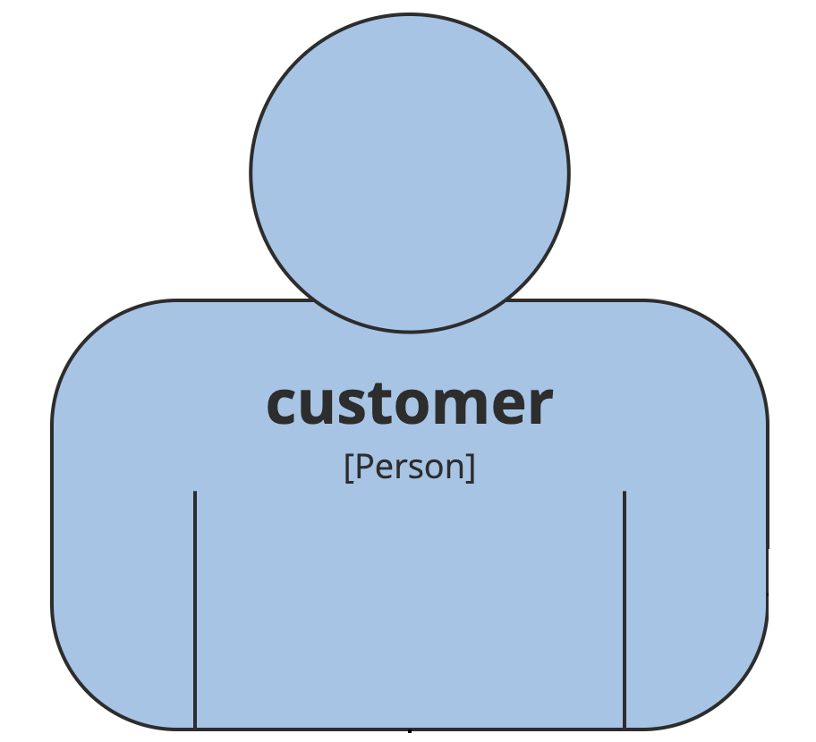
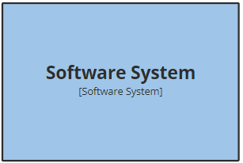
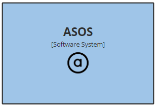
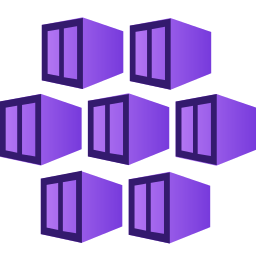

# Structurizr Themes

These are the asos version of structurizr themes and icons so that we can have standardised information which is within our control. In particular this associates icons and colours with specific tags which are used within the structurizr DSL. 

The `theme.json` file contains the most commonly used azure and kubernetes icons. There is also a `theme-full.json` if you want the full list of azure icons available. 

## Usage

Include the theme reference in your structurizr DSL as follows:

`theme  https://raw.githubusercontent.com/ASOS/asos-architecture-structurizr/main/theme.json`

## Standard Colours
| element | Appearance |
|---|---|
| Person  |   |
| softwareSystem, container, component  |   |

## Standard Tags

| Tag | Appearance |
|---|---|
| New |  |
| Modified |  |
| Removed |  |
| ASOS  |   |

## Azure Icons

| Name | Icon |
|---|---|
| Access_Review  |  |
| Active_Directory  |  |
| API_Management_Services  |  |
| App_Service_Environments  |  |
| App_Services  |  |
| Application_Gateway  |  |
| Application_Insights  |  |
| Archive_Storage  |  |
| Automation_Accounts  |  |
| Azure_Cache_for_Redis  |  |
| Azure_Cache_plus_Redis  |  |
| Azure_Cosmos_DB  |  |
| Azure_Data_Catalog  |  |
| Azure_Database_(Generic)  |  |
| Azure_Databricks  |  |
| Azure_Firewall  |  |
| Azure_Search  |  |
| Azure_Service_Bus_Relays  |  |
| Azure_Service_Bus  |  |
| Azure_SQL_DataWarehouse  |  |
| Azure_StorSimple_Device_Managers  |  |
| Blob_Storage  |  |
| Cloud_Services  |  |
| Cognitive_Services  |  |
| Container_Instances  |  |
| Container_Registries  |  |
| Data_Factories  |  |
| Data_Lake_Storage  |  |
| Data_Lake  |  |
| Dedicated_Event_Hub  |  |
| Elastic_Database_Pools  |  |
| Elastic_Job_Agents  |  |
| Event_Grid_Subscriptions  |  |
| Event_Grid_Topics  |  |
| Event_Hubs  |  |
| ExpressRoute_Circuits  |  |
| Front_Doors  |  |
| Function_Apps  |  |
| General_Storage  |  |
| Key_Vaults  |  |
| Kubernetes_Services  |  |
| Load_Balancers  |  |
| Local_Network_Gateways  |  |
| Logic_Apps_Custom_Connector  |  |
| Logic_Apps  |  |
| Network_Security_Groups_(Classic)  |  |
| Queues_Storage  |  |
| Service_Fabric_Clusters  |  |
| SQL_Databases  |  |
| Storage_Accounts  |  |
| Stream_Analytics_Jobs  |  |
| Subscriptions  |  |
| Table_Storage  |  |
| Traffic_Manager_Profiles  |  |
| Virtual_Networks  |  |

## Contributing

Please see our [Contributing](docs/CONTRIBUTING.md) guide to understand our process (maintainer
list, PR Process and Code of Conduct) before making contributions to this repository.
